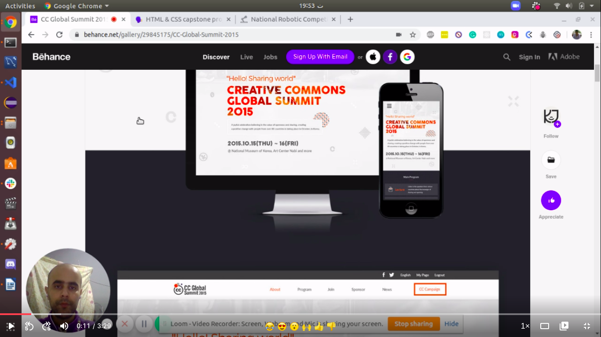

# Capstone Project HTML and CSS

This project is the capstone project of Microverse curriculum HTML and CSS3 section.
The website is about the national robotic competion, a place where passionate peaple meet, learn and compete with each other. The website contain 3 pages, main page where I introduced the competition, the about page where I presented the competition and some previous sessions, finaly the tickets page to reserve your place, all the pages are responsive (break point 768px) and the design is inspired from [Cindy Shin in Behance](https://www.behance.net/adagio07).

## Video presentation

## Desktop views
- main page
 
- about page

- tickets page
 

## Mobile views
- main page

- about page

- tickets page

## Built With

- HTML,
- CSS,
- Flexbox layout.
- Grid layout.
- Bootstrap.

## Live Demo

[Live Demo Link](https://rawcdn.githack.com/HADDADSOHAIB/HTML-capstone-project/5b64b8a1f004ea322f44af9b029ba2fa44bd3328/index.html)

## Authors

👤 **HADDAD SOHAIB**

- Github: [@HADDADSOHAIB](https://github.com/HADDADSOHAIB)
- Twitter: [@HaddadSohaib](https://twitter.com/HaddadSohaib)
- Linkedin: [linkedin](https://www.linkedin.com/in/sohaibhaddad/)

## 🤝 Contributing

Contributions, issues and feature requests are welcome!

Feel free to check the [issues page](issues/).

## Show your support

Give a ⭐️ if you like this project!

## Acknowledgments

- https://www.microverse.org/.
- The website designed by [Cindy Shin in Behance](https://www.behance.net/adagio07)
- https://pixabay.com/

## 📝 License

This project is [MIT](lic.url) licensed.